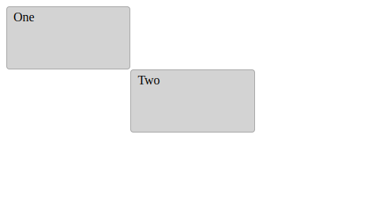

# 01: Basic layout using `eox-layout`

## Import bundle

Import the `@eox/layout` bundle into [main.js](./main.js):

```js
import "https://unpkg.com/@eox/layout";
```

## Add HTML

In [index.html](./index.html), use the `eox-layout` container element to hold the individual items:

```html
<eox-layout></eox-layout>
```

Add individual `eox-layout-item` elements with `x`, `y`, `w` and `h` attributes inside the `eox-layout` slot:

```html
<eox-layout-item x="0" y="0" w="1" h="1">One</eox-layout-item>
<eox-layout-item x="1" y="1" w="1" h="1">Two</eox-layout-item>
```

## Styling

Add some basic styling to [style.css](./style.css).
Make the layout fill the entire page height:

```css
eox-layout {
  height: 100%;
}
```

Give the layout items some basic styling:

```css
eox-layout-item {
  border: 1px solid darkgrey;
  border-radius: 4px;
}
```

## Result

Your page should look something like this:



Feel free to compare with the [solution folder](./solution/)!

Next, try out [section 02](../02%20eox-map/README.md).
