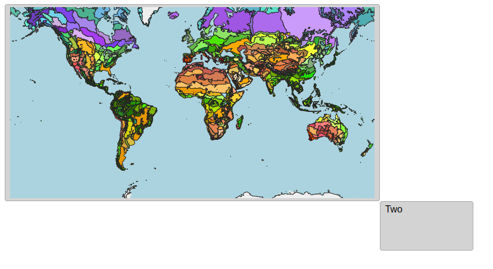

# 02: Using `eox-map`

This section will introduce you to `@eox/map`, one of the main building blocks of any geospatial UI. This map element is based on the popular JS library [OpenLayers](https://github.com/openlayers/openlayers) and adds a layer of convenience plus additional functionality. By the end of this section, you will have created a map with an OSM layer and a vector layer.

## Import package

Import the `@eox/map` package into [main.js](./main.js):

```js
import "https://unpkg.com/@eox/map";
```

## Add HTML

In [index.html](./index.html), use the `eox-map` element inside one of the `eox-layout-item`s:

```html
<eox-layout-item>
  <eox-map></eox-map>
</eox-layout-item>
```

## Styling

Add some basic map styling to [style.css](./style.css).
Note that the map needs some height set in order to be visible:

```css
eox-map {
  height: 100%;
}
```

## Setting the layers

By default, the `eox-map` initializes without layers. In order to set some layers, the `layers` property needs to be set:

```js
document.querySelector("eox-map").layers = [
  {
    type: "Tile",
    source: {
      type: "OSM",
    },
  },
];
```

`layers` expects an object with the following properties:

- `type`: one of the OpenLayers layer types
- properties of OpenLayers [`Layer`](https://openlayers.org/en/latest/apidoc/module-ol_layer_Layer-Layer.html)
- `source`:
  - `type`: one of the OpenLayers source types
  - properties of OpenLayers [`Source`](https://openlayers.org/en/latest/apidoc/module-ol_source_Source-Source.html)
  - optionally a flat representation of formats like [`GeoJSON`](https://openlayers.org/en/latest/apidoc/module-ol_format_GeoJSON-GeoJSON.html) or [`MVT`](https://openlayers.org/en/latest/apidoc/module-ol_format_MVT-MVT.html)

For the possible properties, please refer to the [`EOxLayer type` in the repository](https://github.com/EOX-A/EOxElements/blob/main/elements/map/src/generate.ts#L121-L138).
Please see also all the [layer, sources and formats included in the base bundle](https://eox-a.github.io/EOxElements/?path=/docs/elements-eox-map--docs). For advanced layers & sources, see the next section.

Try to add another layer with the following parameters:

- layer `type`: `Vector`
- source:
  - source `type`: `Vector`
  - source `url`: `https://openlayers.org/data/vector/ecoregions.json`
  - source `format`: `GeoJSON`
- style: use a combination of `stroke-color`, `stroke-width` or any other [OL flat style](https://openlayers.org/en/latest/apidoc/module-ol_style_flat.html) definition, including expressions.

When handling multiple layers, it is necessary to also provide an `id` property for each layer (`properties.id`).

## Result

Your page should look something like this:



Feel free to compare with the [solution folder](./solution/)!

Next, try out [section 03](../03-eox-map-advanced/README.md).
