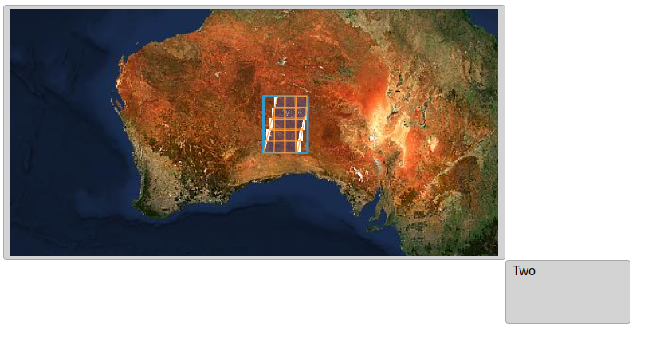

# 03: Advanced usage of `eox-map`

## Import package

In order to use advanced layers and sources in our `eox-map` (all OL `layer` and `source` types, plus some additional custom ones - see [documentation](<(https://eox-a.github.io/EOxElements/?path=/docs/elements-eox-map--docs)>)), we need more than just the base bundle.
Additionally to importing `@eox/map`, now also import the `@eox/map/dist/eox-map-advanced-layers-and-sources.js` package into [main.js](./main.js):

```js
import "https://unpkg.com/@eox/map/dist/eox-map-advanced-layers-and-sources.js";
```

## Setting the layers

Let's add two more layers to our `eox-map`:

### Tile layer with WMTS source from capabilities

This custom source fetches a capabilities xml and automatically renders the defined layer:

```js
{
  type: "Tile",
  properties: {
    id: "s2cloudless"
  },
  source: {
    type: "WMTSCapabilities",
    url: "https://tiles.maps.eox.at/wmts/1.0.0/WMTSCapabilities.xml",
    layer: "s2cloudless-2020_3857",
  },
},
```

### Layer from STAC

This custom layer creates a layer (group) from e.g. a STAC collection. Powered by the Open Source library [ol-stac](https://github.com/m-mohr/ol-stac).

```js
{
  type: "STAC",
  properties: {
    id: "stacLayer",
  },
  url: "https://tamn.snapplanet.io/search?bbox=125.727770,-29.514858,133.412707,-23.673395&collections=S2",
  displayPreview: true,
},
```

### Setting zoom and center

Try setting the `zoom` and `center` properties to focus the map on Australia:

```js
document.querySelector("eox-map").zoom = 4;

document.querySelector("eox-map").center = [125, -30];
```

Note: in real-world usecases, you'd probably not want to set these properties separately, but rather use the `config` object (see [example](https://eox-a.github.io/EOxElements/?path=/story/elements-eox-map--config-object)) or via e.g. the `zoomExtent`:

```js
document.querySelector("eox-map").config: {
  layers: [...],
  view: {
    zoomExtent: ...
  }
}

```

## Result

Your page should look something like this (if you zoom to Australia):



Feel free to compare with the [solution folder](./solution/)!

Next, try out [section 04](../04%20eox-layercontrol/README.md).
