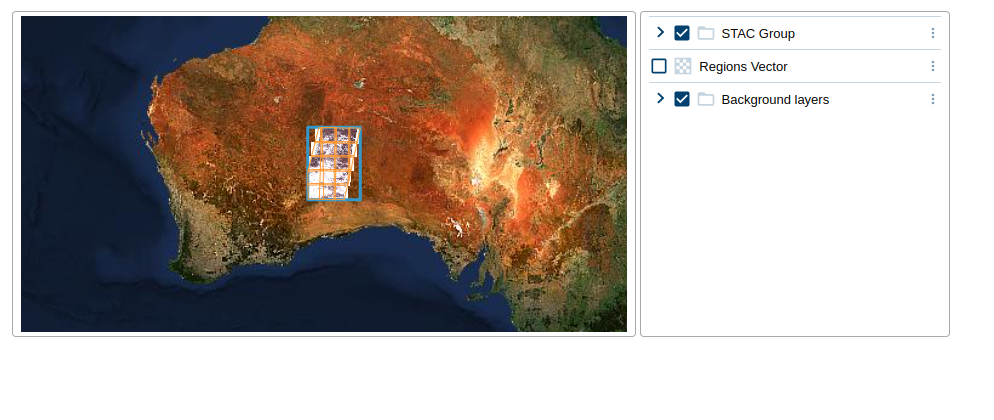

# 04: Using `eox-layercontrol`

## Import package

Import the `@eox/layercontrol` package into [main.js](./main.js):

```js
import "https://unpkg.com/@eox/layercontrol";
```

## Add HTML

In [index.html](./index.html), use the `eox-layercontrol` element inside one of the `eox-layout-item`s:

```html
<eox-layout-item>
  <eox-layercontrol></eox-layercontrol>
</eox-layout-item>
```

## Styling

Let's change the `eox-layout` config and the styling in [style.css](./style.css) to better suit our current setup.

Restructure the layout:

```html
<eox-layout gap="4">
  <eox-layout-item x="0" y="0" w="4" h="4">
    <eox-map></eox-map>
  </eox-layout-item>
  <eox-layout-item x="4" y="0" w="2" h="4">
    <eox-layercontrol></eox-layercontrol>
  </eox-layout-item>
</eox-layout>
```

Change the background to white:

```css
eox-layout-item {
  [...]
  background: white;
}
```

## Layer properties

In order to better display the map layers in the layercontrol, let's add some layer properties (see [documentation](https://eox-a.github.io/EOxElements/?path=/docs/elements-eox-layercontrol--docs)):

- `title`: human-friendly title for the layer
- `description`: description to display in the layercontrol
- `layerControlExclusive`: all layers on the same level with this property are mutually exclusive
- `visible` (OL property): initial visibility of the layer

Please see the [EOxElements docs](https://eox-a.github.io/EOxElements/?path=/docs/elements-eox-layercontrol--docs) for more properties and examples for `eox-layercontrol`.

Once the layercontrol is working, you can also try the following:

- view the description of a layer
- change the opacity of a layer
- try to change the visual order of layers
- try to hide one of the layers from the layercontrol
- configure the layercontrol to allow adding external layers

## Result

Your page should look something like this:



Feel free to compare with the [solution folder](./solution/)!

Next, try out [section 05](../05-eox-itemfilter/README.md).
