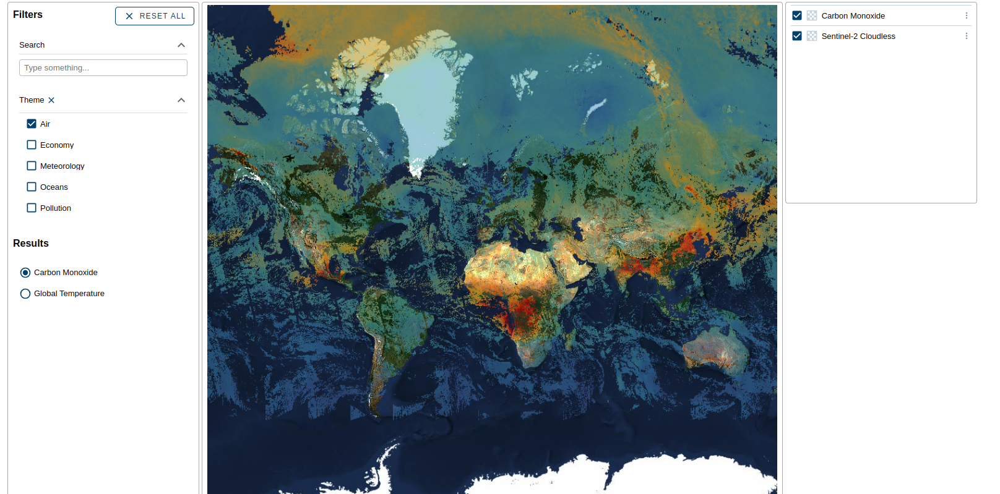

# 05: Using `eox-itemfilter`

## Import package

Import the `@eox/itemfilter` package into [main.js](./main.js):

```js
import "https://unpkg.com/@eox/itemfilter";
```

## Add HTML

In [index.html](./index.html), use the `eox-itemfilter` element inside a new `eox-layout-item`, adapting the layout further as needed:

```html
<eox-layout gap="4">
  <eox-layout-item x="0" y="0" w="2" h="12">
    <eox-itemfilter></eox-itemfilter>
  </eox-layout-item>
  <eox-layout-item x="2" y="0" w="6" h="12">
    <eox-map></eox-map>
  </eox-layout-item>
  <eox-layout-item x="8" y="0" w="2" h="4">
    <eox-layercontrol></eox-layercontrol>
  </eox-layout-item>
</eox-layout>
```

## `eox-itemfilter` items

To add a selectable list of items, set the `items` property of `eox-itemfilter`:

```js
document.querySelector("eox-itemfilter").items = [
  {
    title: "Houses",
    themes: ["Population"],
  },
  {
    title: "Ships",
    themes: ["Atmosphere", "Oceans"],
  },
  {
    title: "Trees",
    themes: ["Atmosphere", "Biomass"],
  },
];
```

This renders a selectable list of items.

## `eox-itemfilter` config

Let's add a `config` property to define a filter and a callback function to trigger when an item is selected:

```js
document.querySelector("eox-itemfilter").config = {
  filterProperties: [
    {
      key: "themes",
      title: "Theme",
      type: "multiselect",
    },
  ],
  onSelect: (item) => alert(`Selected: ${item.title}`),
};
```

For a full list of available config properties, please have a look at the [`eox-itemfilter` docs](https://eox-a.github.io/EOxElements/?path=/docs/elements-eox-itemfilter--docs).

## Real-world example

For a more realistic and useful usecase, try the following config and items:

<details>
<summary>Expand</summary>

```js
Object.assign(document.querySelector("eox-itemfilter"), {
  config: {
    filterProperties: [
      // added full-text search filter
      {
        keys: ["title"],
        title: "Search",
        type: "text",
        expanded: true,
      },
      {
        key: "themes",
        title: "Theme",
        type: "multiselect",
        expanded: true,
      },
    ],
    onSelect: (item) => {
      const eoxMap = document.querySelector("eox-map");
      // fetch the STAC collection
      fetch(item.stac)
        .then((response) => response.json())
        .then((json) => {
          // find the link with `rel` "wms"
          const wmsLink = json.links.find((l) => l.rel === "wms");
          // push the new layer definition to the eox-map layers
          eoxMap.layers = [
            {
              type: "Tile",
              properties: {
                id: item.id,
                title: item.title,
              },
              source: {
                type: "TileWMS",
                url: wmsLink.href,
                params: {
                  LAYERS: wmsLink["wms:layers"],
                },
              },
            },
            ...eoxMap.layers,
          ];
        });
    },
  },
  items: [
    {
      title: "Global Temperature",
      id: "global-temperature",
      themes: ["Air", "Meteorology"],
      stac: "https://eurodatacube.github.io/eodash-catalog/RACE/meteorological_variables/temperature/collection.json",
    },
    {
      title: "Carbon Monoxide",
      id: "carbon-monoxide",
      themes: ["Air", "Pollution"],
      stac: "https://eurodatacube.github.io/eodash-catalog/RACE/global_parameters/CO_3_daily/collection.json",
    },
    {
      title: "Vessel Density",
      id: "vessel-density",
      themes: ["Economy", "Oceans"],
      stac: "https://eurodatacube.github.io/eodash-catalog/RACE/vessel_density/vessel_density_all/collection.json",
    },
  ],
});
```

</details>

## Result

Your page should look something like this:



Feel free to compare with the [solution folder](./solution/)!

Next, try out [section 06](../06%20eox-stacinfo/README.md).
