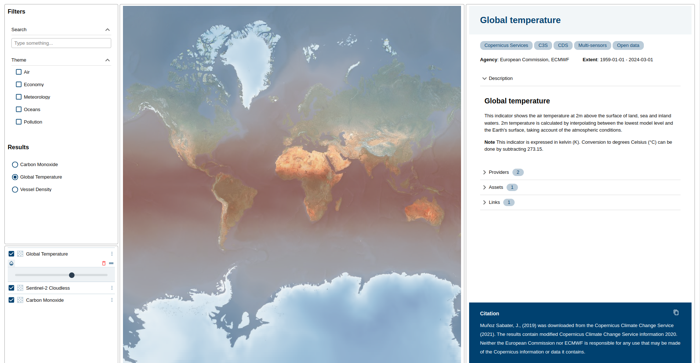

# 06: Using `eox-stacinfo`

When working with STAC, it is often times needed to display the contents of a JSON file in a nicely formatted manner. This section will introduce you to `eox-stacinfo` and some basic configuration.

## Import package

Import the `@eox/stacinfo` package into [main.js](./main.js):

```js
import "https://unpkg.com/@eox/stacinfo";
```

## Add HTML

In [index.html](./index.html), use the `eox-stacinfo` element inside a new `eox-layout-item`, adapting the layout further as needed:

```html
<eox-layout gap="4">
  <eox-layout-item x="0" y="0" w="2" h="8">
    <eox-itemfilter></eox-itemfilter>
  </eox-layout-item>
  <eox-layout-item x="2" y="0" w="6" h="12">
    <eox-map></eox-map>
  </eox-layout-item>
  <eox-layout-item x="0" y="8" w="2" h="4">
    <eox-layercontrol></eox-layercontrol>
  </eox-layout-item>
  <eox-layout-item x="8" y="0" w="4" h="12">
    <eox-stacinfo></eox-stacinfo>
  </eox-layout-item>
</eox-layout>
```

## `eox-stacinfo` config

In order to show the information of a STAC file inside `eox-itemfilter`, set the `for` property. This can be done for example on the click handler of `eox-itemfilter`:

```js
document.querySelector("eox-stacinfo").for = item.stac;
```

Be default, all properties of the STAC file are displayed. We can create a list of properties we want to display, and assign them to certain slots:

```js
Object.assign(document.querySelector("eox-stacinfo"), {
  header: ["title"],
  tags: ["tags"],
  properties: ["satellite", "sensor", "agency", "extent"],
  featured: ["description", "providers", "assets", "links"],
  footer: ["sci:citation"],
});
```

Please consult the [`eox-stacinfo` docs](https://eox-a.github.io/EOxElements/?path=/docs/elements-eox-stacinfo--docs) for more information.

## Styling

In case the content inside an `eox-layout-item` is too long for the container, you can add some css to mitigate that:

```css
overflow-y: auto;
```

## Result

Your page should look something like this:



Feel free to compare with the [solution folder](./solution/)!
