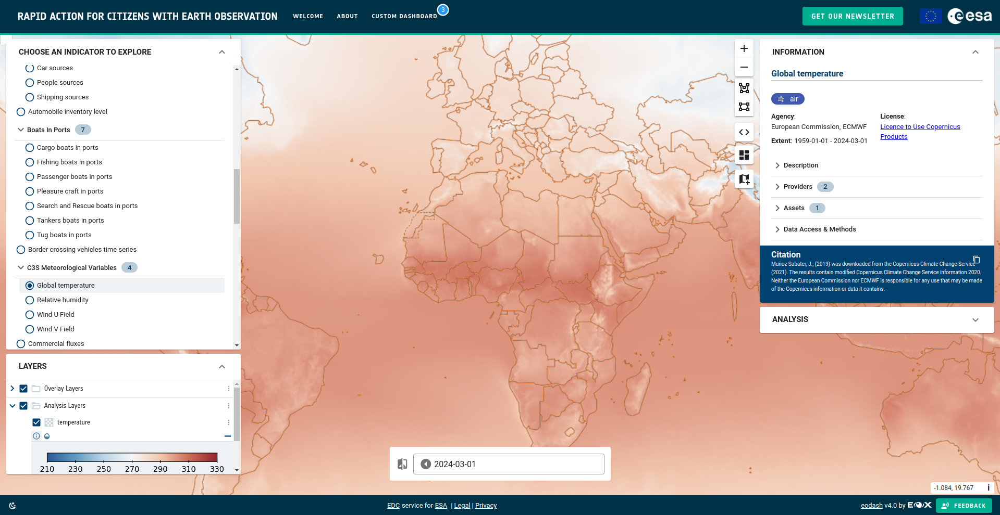
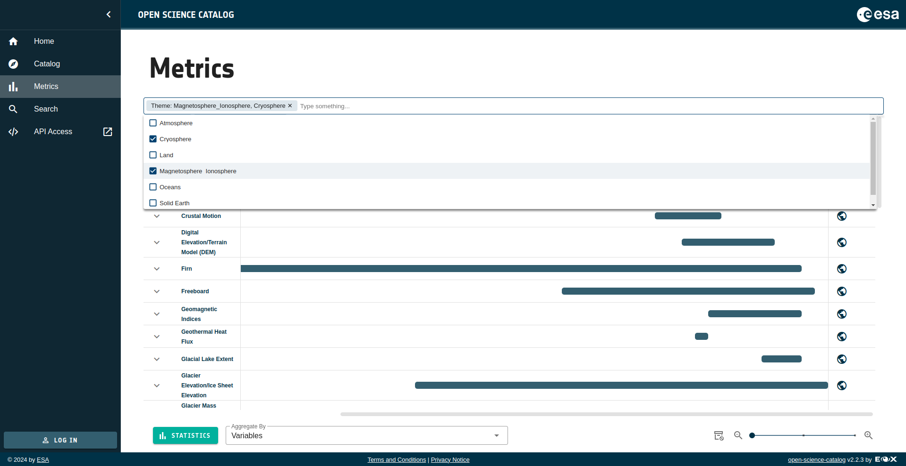
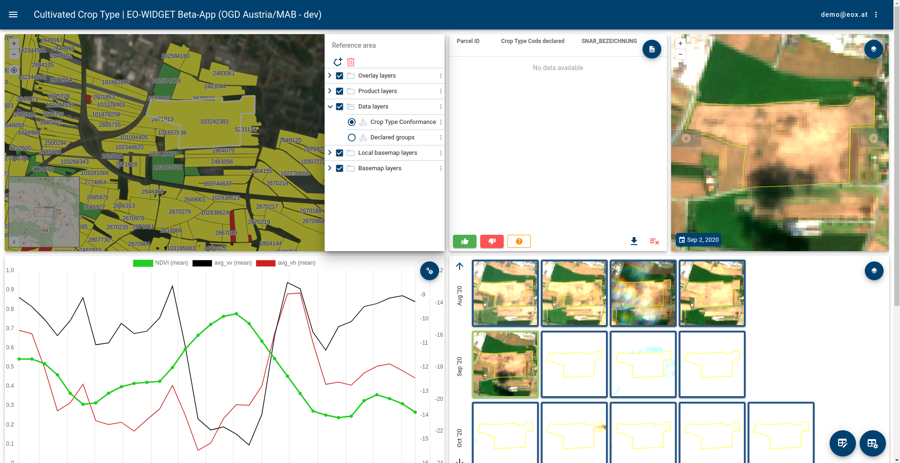
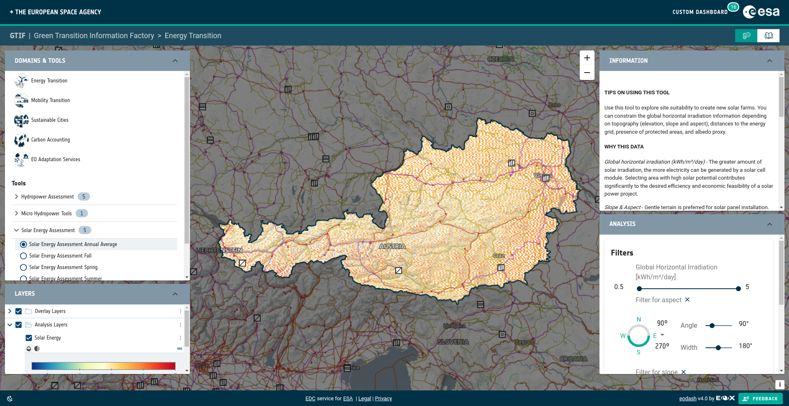

# Introduction to EOxElements

## What are the EOxElements?

The EOxElements are an opinionated widget library, built with the goal of facilitating bootstrapping web app GUIs in the Earth Observation (EO) domain. They are being built as [open source community project](https://github.com/EOX-A/EOxElements) for anyone to use, but the main driver for requirements, implementing features, updates etc. are existing and future activities by EOX. The EOxElements consist of widgets commonly found in GUIs: layout, map, layer control, drawing tools, geosearch, timecontrol etc. See them in action: [EOxElements Docs & Examples](https://eox-a.github.io/EOxElements/)

## Why a widget library?

Life's too short to rebuild everything from scratch when starting a new project; copy-pasting snippets of code from one project to another proved to be rarely possible, because of deeply intertwined dependencies, mismatch in JS frameworks etc. The aim with EOxElements is to build something that is **modular** and **reusable**, **generic** enough to be used in many apps, but **configurable** enough to suit the specific needs of each app.

## Who is building them?

The initiator and maintainer of the EOxElements is the company [EOX](https://eox.at); currently a team of around 5 engineers are actively contributing to the code base, whereas the whole company is using the elements in various projects and providing valuable feedback.

## What's the current development status?

Some of the elements are released as a rather stable `v1.0.0`, but most of them are still in the `alpha`/`beta` state. The are already used internally for EOX projects, but it is expected to have breaking changes quite often before reaching `v1.0.0`.

## What are some example uses?

